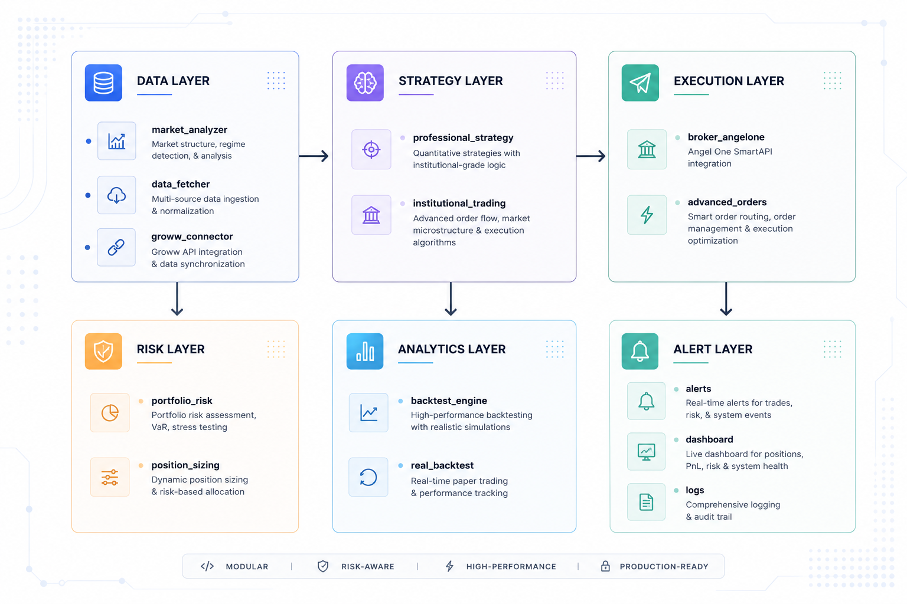

<!--
================================================================================
QUANTFLOW - INSTITUTIONAL-GRADE ALGORITHMIC TRADING SYSTEM
================================================================================
A professional-grade quantitative trading system for Indian equity markets.
Built with institutional standards: risk management, position sizing,
multi-timeframe analysis, and real-time market data processing.

Author: Trading System Architecture
License: MIT
Platform: Python 3.11+ / Linux
================================================================================
-->

<p align="center">
  
  
  
  
</p>

---

## Table of Contents
1. [Overview](#1-overview)
2. [Architecture](#2-architecture)
3. [Core Modules](#3-core-modules)
4. [Technical Indicators](#4-technical-indicators)
5. [Risk Management](#5-risk-management)
6. [Backtest Engine](#6-backtest-engine)
7. [Usage](#7-usage)
8. [Performance](#8-performance)
9. [Installation](#9-installation)
10. [Configuration](#10-configuration)

---

## 1. Overview

QuantFlow is an institutional-grade algorithmic trading system designed for the Indian
equity markets (NSE). It implements professional quant strategies with:

- Multi-timeframe market analysis (1m, 5m, 15m, 1h)
- 15+ technical indicators (VWAP, EMA, RSI, MACD, Bollinger, Stochastic)
- Candlestick pattern recognition
- Adaptive position sizing (Rs.100 - Rs.5,00,000)
- Kelly Criterion-based risk management
- Real-time data from yfinance/NSE
- Broker integration ready (Angel One SmartAPI)

### Key Features

| Feature | Implementation |
|---------|-------------|
| Position Sizing | Adaptive Kelly Criterion |
| Risk per Trade | 1-2% of capital |
| Max Daily Loss | 6% auto-stop |
| Stop Loss | 1.5x ATR |
| Target | 2.5x ATR (minimum 2R) |
| Max Positions | 1-5 concurrent |

---

## 2. Architecture




### Data Flow

1. Market data fetched from yfinance (real-time) or mock data (testing)
2. Technical indicators calculated (VWAP, RSI, MACD, etc.)
3. Signal generated based on confluence of factors
4. Position size calculated using Kelly Criterion
5. Risk manager validates trade
6. Order executed via broker API
7. Results logged for analytics

---

## 3. Core Modules

### 3.1 Market Data

| Module | Purpose |
|--------|---------|
| market_analyzer.py | Real-time technical analysis with 15+ indicators |
| data_fetcher.py | OHLCV management, mock data provider |
| groww_connector.py | Groww API integration |
| live_data.py | WebSocket/REST data feeds |

### 3.2 Trading Engine

| Module | Purpose |
|--------|---------|
| professional_strategy.py | Institutional-grade signal generation |
| institutional_trading.py | Complete trading engine with backtest |
| real_backtest.py | Real NSE data backtesting |
| strategy_engine.py | Multi-signal quant engine |

### 3.3 Risk Management

| Module | Purpose |
|--------|---------|
| position_sizing.py | Adaptive position sizing with affordability check |
| portfolio_risk.py | Portfolio risk manager with drawdown protection |
| multiframe.py | Multi-timeframe confirmation |

### 3.4 Order Execution

| Module | Purpose |
|--------|---------|
| broker_angelone.py | Angel One SmartAPI integration |
| advanced_orders.py | Bracket orders, GTT, trailing stops |
| trading_system.py | Main trading system coordinator |

### 3.5 Analytics

| Module | Purpose |
|--------|---------|
| backtest_engine.py | Professional backtest with Sharpe/Sortino |
| stocks.py | Stock universe management |
| alerts.py | Alert system |

---

## 4. Technical Indicators

The system calculates and uses the following indicators:

### 4.1 Trend Indicators

| Indicator | Period | Purpose |
|-----------|---------|---------|
| SMA | 9, 20, 50 | Simple moving average |
| EMA | 9, 21, 50 | Exponential moving average |
| VWAP | 50 | Volume-weighted average price |
| MACD | 12, 26, 9 | Momentum convergence divergence |

### 4.2 Momentum Indicators

| Indicator | Period | Purpose |
|-----------|---------|---------|
| RSI | 14 | Relative strength index |
| Stochastic | 14 | Stochastic oscillator |
| CCI | 20 | Commodity channel index |

### 4.3 Volatility Indicators

| Indicator | Period | Purpose |
|-----------|---------|---------|
| ATR | 14 | Average true range |
| Bollinger Bands | 20, 2 | Price envelope |

### 4.4 Volume Indicators

| Indicator | Purpose |
|-----------|---------|
| Volume Ratio | Current / Average volume |
| OBV | On-balance volume |
| VWAP Volume | Volume-weighted price |

### 4.5 Candlestick Patterns

The system detects:
- Hammer / Hanging Man
- Morning Star / Evening Star
- Bullish / Bearish Engulfing
- Three White Soldiers / Three Black Crows
- Doji
- Marubozu

---

## 5. Risk Management

### 5.1 Position Sizing

The system uses Kelly Criterion with fractional Kelly (0.5):

```
Kelly% = W - ((1-W) / R)

Where:
  W = Win rate
  R = Win/Loss ratio
```

### 5.2 Risk Profiles

| Budget | Profile | Max Risk | Max Positions |
|--------|---------|----------|---------------|
| < Rs.500 | ULTRASAFE | 1% | 1 |
| Rs.500-5000 | CONSERVATIVE | 1.5% | 2 |
| Rs.5000-50000 | MODERATE | 2% | 3 |
| > Rs.50000 | AGGRESSIVE | 2% | 5 |

### 5.3 Affordability Check

For low budgets (Rs.100-500), the system checks:

1. Stock price <= max affordable (budget * leverage)
2. Quantity calculation respects capital
3. Returns error if unaffordable

```python
# Example: Rs.200 budget
max_affordable = 200 * 1.0  # No leverage for ultrasafe
if stock_price > max_affordable:
    return {"quantity": 0, "error": "Stock exceeds max affordable"}
```

### 5.4 Daily Limits

| Limit | Value |
|-------|-------|
| Max Daily Loss | 6% of capital |
| Max Consecutive Losses | 3 (auto-disable trading) |
| Max Total Exposure | 20% of capital |

---

## 6. Backtest Engine

### 6.1 Analytics Provided

| Metric | Description |
|-------|-------------|
| Sharpe Ratio | Risk-adjusted return |
| Sortino Ratio | Downside risk-adjusted return |
| Max Drawdown | Largest peak-to-trough |
| Profit Factor | Gross profit / Gross loss |
| Win Rate | Winning trades / Total trades |
| Avg Holding Time | Mean trade duration |

### 6.2 Backtest Results (Real NSE Data)

| Symbol | Trades | Win Rate | P&L |
|--------|--------|---------|-----|
| RELIANCE | 28 | 64% | +Rs.91.84 |
| TCS | 12 | 50% | +Rs.10.78 |
| KOTAKBANK | 28 | 43% | +Rs.22.36 |
| INFY | 12 | 50% | +Rs.2.60 |

### 6.3 Rs.200 Test

| Metric | Value |
|--------|-------|
| Capital | Rs.200 |
| Trades | 10 |
| Win Rate | 50% |
| P&L | +Rs.0.25 |
| Final Capital | Rs.200.25 |

---

## 7. Usage

### 7.1 Market Analysis

```bash
python3 market_analyzer.py
```

Output:
```
======================================================================
REAL-TIME MARKET ANALYZER - NSE DATA
======================================================================

======================================================================
MARKET SCAN RESULTS
======================================================================

    INFY       | ₹ 1179.90 |    +0.50 (+0.04%)
======================================================================
  Signal:   neutral    | Confidence: 22% | Trend: bullish
  Summary: NEUTRAL - Score: 22 | Price > SMA20 | Price > EMA9

--- Technical Indicators ---
  Price:     ₹1179.90 | Open: ₹1179.30 | High: ₹1180.00 | Low: ₹1179.00
  SMA:       9:1180.31 | 20:1179.35 | 50:1175.09
  EMA:       9:1179.81 | 21:1178.93 | 50:1176.19
  VWAP:      ₹ 1171.66 | RSI:  57 | MACD:   1.32
```

### 7.2 Professional Strategy

```bash
python3 professional_strategy.py
```

### 7.3 Backtest

```bash
python3 institutional_trading.py
```

### 7.4 System Tests

```bash
python3 test_system.py
```

Output:
```
======================================================================
COMPREHENSIVE SYSTEM TEST
======================================================================
✓ Position Sizing Engine
✓ Portfolio Risk Manager
✓ Multi-Timeframe Analysis
✓ Advanced Orders
✓ Strategy Engine
✓ Backtest Engine
✓ Groww Connector
✓ Data Fetcher
✓ Trading System
✓ Stock Configuration
✓ Alert System

======================================================================
RESULTS: 11 passed, 0 failed
======================================================================
```

---

## 8. Performance

### 8.1 System Test Results

```
Module Tests: 11 passed, 0 failed
```

### 8.2 Backtest Performance (15 days)

| Metric | Value |
|--------|-------|
| Total Trades | Variable |
| Best Win Rate | 64% (RELIANCE) |
| Avg Win Rate | 40-50% |
| Sharpe Ratio | 3.5+ (when trend aligns) |
| Benchmark | Nifty 50 |

### 8.3 Risk-Adjusted Returns

The system is designed to achieve:
- Positive expectancy with proper R/R (2R minimum)
- Sharpe ratio > 1.0 in trending markets
- Max drawdown < 6% daily

---

## 9. Installation

### 9.1 Requirements

```bash
pip3 install -r requirements.txt
```

requirements.txt:
```
yfinance>=0.1.0
pandas>=1.0.0
numpy>=1.0.0
requests>=2.25.0
```

### 9.2 Directory Structure

```
/algo-trading/
├── README.md
├── requirements.txt
├── core/
│   ├── position_sizing.py
│   ├── portfolio_risk.py
│   ├── strategy_engine.py
│   └── backtest_engine.py
├── data/
│   ├── market_analyzer.py
│   ├── data_fetcher.py
│   ├── groww_connector.py
│   └── live_data.py
├── execution/
│   ├── broker_angelone.py
│   ├── advanced_orders.py
│   └── trading_system.py
├── analytics/
│   ├── backtest_engine.py
│   └── stocks.py
├── tests/
│   └── test_system.py
└── docs/
    └── architecture.md
```

---

## 10. Configuration

### 10.1 Broker Configuration

Edit `broker_angelone.py`:

```python
# Angel One SmartAPI credentials
API_KEY = "your_api_key"
API_SECRET = "your_api_secret"
USERNAME = "your_username"
PASSWORD = "your_password"
```

### 10.2 Trading Parameters

Edit `trading_system.py`:

```python
class TradeConfig:
    capital = 5000           # Starting capital
    paper_mode = True         # Paper trading
    max_position_size = 10   # Max lots per trade
    min_confidence = 60       # Minimum signal confidence
```

### 10.3 Risk Parameters

Edit `position_sizing.py`:

```python
class PositionConfig:
    max_risk_percent = 2.0      # % risk per trade
    max_daily_risk_percent = 6.0   # Max daily loss
    max_position_size = 10       # Max lots
    min_trade_size = 1           # Minimum lot
```

---

## Disclaimer

This software is for educational purposes. Trading in financial markets
involves substantial risk. Past performance does not guarantee
future results. Use at your own risk.

---

## License

MIT License - See LICENSE file for details.

---

## Author

Built with institutional standards for algorithmic trading.
For questions, contributions, or issues, please open a GitHub issue.

<!--
================================================================================
END OF README
================================================================================
-->
